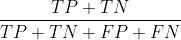
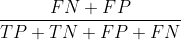
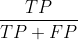
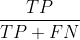
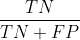
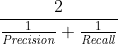
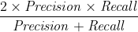
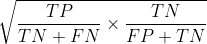

# Evaluation
모델 성능 평가 지표

# 이진 분류
## 평가 기준
이진 분류에서 성능 지표로 잘 활용되는 오차행렬 사용

## 평가 지표
### 입력 값
- P : 전체 참인 수
- N : 전체 거짓인 수

- TP (True Positive) : 참을 참이라고 한 횟수
- TN (True Negative) : 거짓을 거짓이라고 한 횟수
- FN (False Negative) : 참을 거짓이라고 한 횟수
- FP (False Positive) : 거짓을 참이라고 한 횟수

### 계산식
- Accuracy : 정확도, 제대로 분류된 데이터의 비율
    - 

- Error Rate : 오류율, 잘못 분류한 데이터의 비율
    - 

- Precision : 정밀도, 예측한 정답 중 실제 정답인 것
    - 모델 관점
    - 

- sensitivity : 재현율, 실제 정답 중 예측에 성공한 것
    - 데이터 관점
    - 참인 정답이 적을 때 유효
    - 

- specificity : it measures how much a classifier can recognize negative examples
    - 

- F1-Score : Precision과 Recall의 조화평균,
    - recall과 precision의 조화 평균
    - 
    - 

- Geometric Mean : 균형 정확도
    - 참에 대한 정확도와, 거짓에 대한 정확도를 따로 분류해 기하 평균을 구함
    - 

# 다항 분류
## 평가 기준

### True Positive

### True Negative for A

### True Negative for D

### False Positive for A

### False Positive for B

### False Negative for A

### Accuracy (정확도)

True positive / total dataset

### In balanced data

### In imbalanced data

**Accuracy works well on balanced data**

## Precision

각 클래스별 Precision의 평균

## Recall

각 클래스별 Recall의 평균

## F1 Score

